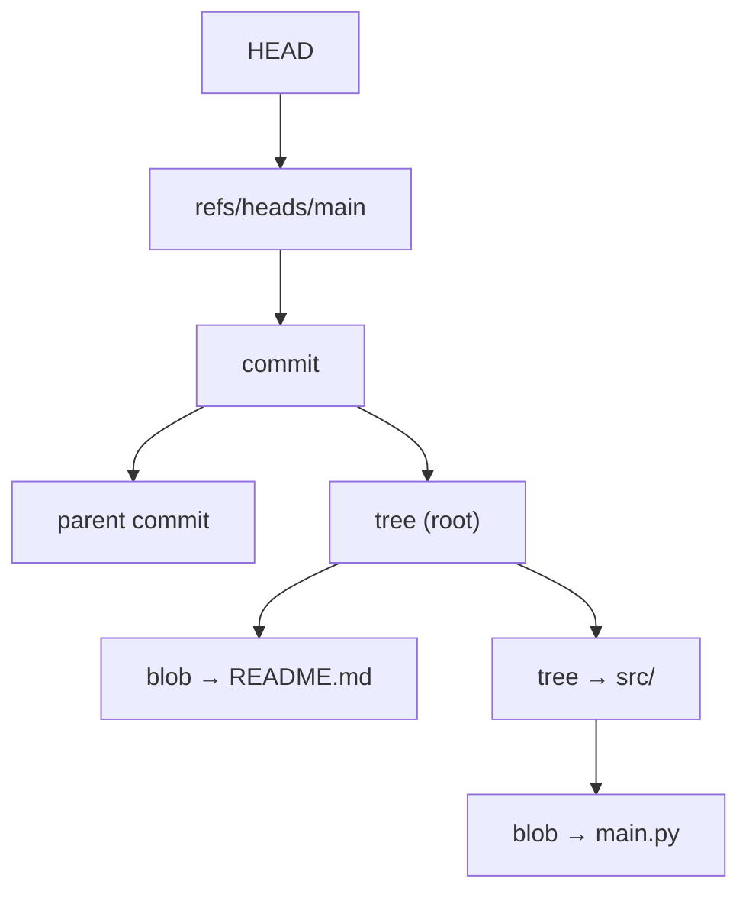

# wyag — Write Yourself a Git

> A working Git implementation written from scratch in pure Python — built to understand version control from the bytes up, not just to use it.


---

## About

`wyag` is a from-scratch reimplementation of Git's core plumbing and porcelain in Python, with **zero third-party dependencies** — just the standard library and a careful reading of how Git actually stores history on disk.


The original walkthrough comes from Thibault Polge's excellent [*Write Yourself a Git*](https://wyag.thb.lt/). This repo follows that scaffold for the foundational commands, then departs from it to build new capabilities independently.

---

## Why I built it

I learn fastest by building the thing, not reading about it. Git is something every engineer uses dozens of times a day, yet most of us treat its internals as magic. Rebuilding it from scratch was super fun — content-addressable storage, the object graph, the index format, and how a "commit" is really just a tiny file pointing at other tiny files.

---

## 🧠 What's under the hood

Git is, at its core, a **content-addressable filesystem** with a version-control UI bolted on top. `wyag` rebuilds that filesystem piece by piece.




---

## 📦 Commands implemented

Following the tutorial scaffold, `wyag` ships a functional subset of Git's plumbing and porcelain:

| Command | Layer | What it does |
| --- | --- | --- |
| `init` | porcelain | Create a new repository |
| `hash-object` | plumbing | Hash (and optionally store) a file as a blob |
| `cat-file` | plumbing | Read any object back out of the store |
| `ls-tree` | plumbing | Pretty-print a tree object |
| `ls-files` | plumbing | List entries in the staging index |
| `rev-parse` | plumbing | Resolve names / short hashes to full object IDs |
| `show-ref` | plumbing | List all references |
| `add` | porcelain | Stage changes into the index |
| `rm` | porcelain | Remove files from the index and working tree |
| `status` | porcelain | Compare HEAD ↔ index ↔ working tree |
| `commit` | porcelain | Record a new commit from the index |
| `log` | porcelain | Walk and display commit history |
| `checkout` | porcelain | Instantiate a tree into a directory |
| `tag` | porcelain | Create lightweight and annotated tags |
| `check-ignore` | porcelain | Evaluate paths against `.gitignore` rules |

> Run `wyag <command> --help` for usage on any of the above.

---

## 🚀 Going beyond the tutorial

This is where the project stops being a tutorial and starts being mine. With the object model and index fully understood, I'm building features WYAG never covers:

- **`diff` — in progress.** Tree-to-tree and blob-to-blob comparison, computing line-level changes with a Myers diff algorithm to produce real unified-diff output.
- **`merge` — in progress.** Three-way merge: finding the lowest common ancestor (merge base) of two commits, then reconciling *base / ours / theirs* to produce a merged tree (with conflict detection where the histories disagree).

**Roadmap / exploring next:**
- `branch` management as a first-class command
- Fast-forward vs. true merge-commit handling
- Conflict-marker output compatible with standard tooling

---

## 🛠️ Getting started

**Requirements:** Python 3.10+ (standard library only — nothing to `pip install`).

```bash
# Clone
git clone https://github.com/ttkgas/wyag_learning.git
cd wyag_learning

mkdir my-repo
cd my-repo
```

**A quick tour:**

```bash
# Initialize a repo
../wyag init my-repo && cd my-repo

# Store a file as a blob and get its hash
echo "hello" > hello.txt
../wyag hash-object -w hello.txt

# Read it back
../wyag cat-file blob <hash>

# Stage, commit, inspect
../wyag add hello.txt
../wyag commit -m "First commit, no Git involved"
../wyag log
```

---


## 📚 Sources & acknowledgments

- **[Write Yourself a Git](https://wyag.thb.lt/)** by Thibault Polge — the tutorial that scaffolded the foundational commands.
- The merge and diff work is built independently on top of that foundation.

---

<div align="center">

**Built by Tejas Alagiri Kannan** &nbsp;

[Portfolio](#) &nbsp;·&nbsp; [GitHub](https://github.com/ttkgas) &nbsp;·&nbsp; [LinkedIn](https://www.linkedin.com/in/tejasakannan/)

</div>